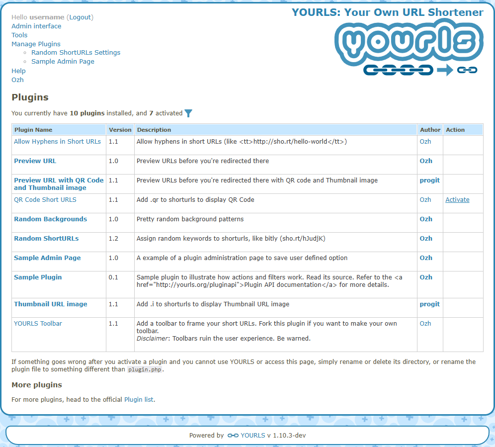
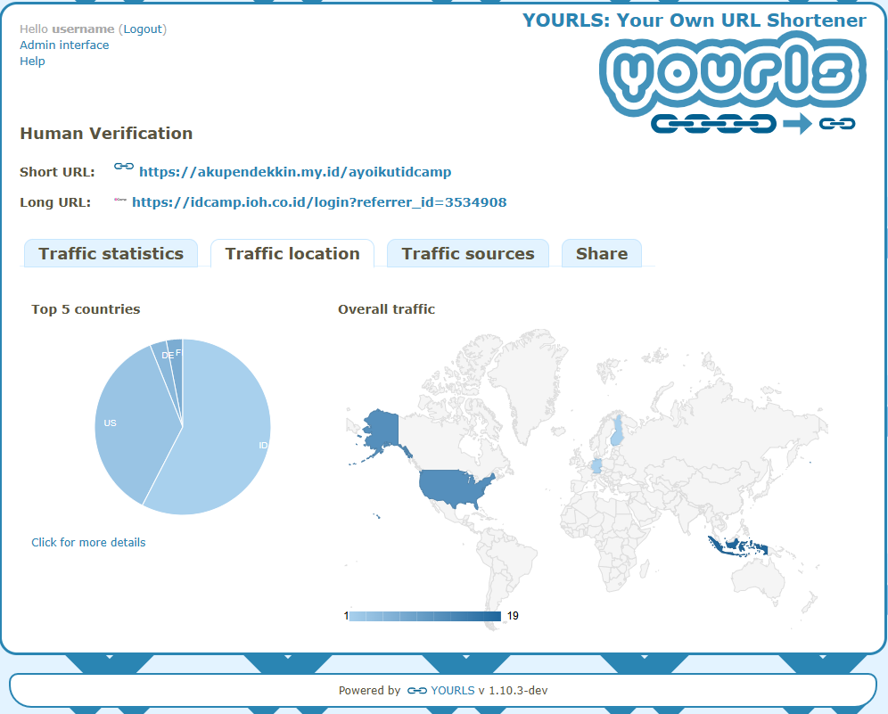

# Project Hosting YOURLS [Kelompok 4/Paralel 1]

<p align="center">
  
</p>

<h1 align="center">YOURLS - Your Own URL Shortener</h1>
<p align="center" style="font-size: 18px;"><b><i>The de facto standard self-hosted URL shortener</i></b></p>

<div align="center">

| [Deskripsi](#deskripsi-aplikasi) | [Instalasi](#instalasi) | [Cara Pemakaian](#cara-pemakaian) | [Kustomisasi dan Plugin](#kustomisasi-dan-plugin) | [Pembahasan](#pembahasan) | [Referensi](#referensi) |
|----------------------------------|-------------------------|-----------------------------------|--------------------------------|---------------------------|-------------------------|

</div>

---

## Deskripsi Aplikasi

**YOURLS** (*Your Own URL Shortener*) adalah platform URL shortener berbasis PHP yang bersifat *self-hosted* dan gratis. Platform ini memungkinkan pembuatan tautan pendek dengan domain kustom, pemantauan statistik penggunaan, serta penambahan fitur melalui sistem plugin. Sebagai proyek open source, YOURLS menjadi solusi andal untuk pengelolaan tautan secara mandiri dan profesional.

---

<details>
<summary><b>Anggota Kelompok</b></summary>

| Nama                                   | NIM           |
|---------------------------------------|---------------|
| <a href="https://github.com/qois51" target="_blank">Qois Firosi</a>            | G6401231031   |
| <a href="https://github.com/prakoso09" target="_blank">Gilang Agung Prakoso</a> | G6401231039   |
| <a href="https://github.com/AghnatHs" target="_blank">Aghnat Hasya Sayyidina</a> | G6401231074   |
| <a href="https://github.com/HusniAbdillah" target="_blank">Husni Abdillah</a>   | G6401231097   |
| <a href="https://github.com/insanansharyrasul" target="_blank">Insan Anshary Rasul</a> | G6401231132   |

</details>

---

## Instalasi

1. Siapkan VPS / VM (Bisa dari Azure, AWS, GCP, Hetzner, Hostinger, dan sejenisnya) dan Domain (pointing ke IP VM)
2. Connect ke server  (dalam case ini VM menggunakan Azure dan OS Ubuntu, dan SSH)
```
ssh kdjkroot@20.78.34.223
```
3. Update
```
apt-get update && apt-get upgrade -y
```
4. Install Git dan Nano (jika belum ada)
```
apt-get install git nano -y
```
5. Install NGINX (untuk webserver dan reverse proxy)
```
apt-get install nginx -y
systemctl start nginx
systemctl enable nginx
```
6. Install MariaDB
```
apt-get install mariadb-server -y
systemctl start mariadb
systemctl enable mariadb
```
7. Install PHP and modul - modulnya (Yourls menggunakan PHP)
```
apt-get install php php-fpm php-xml php-pear php-cli php-zip php-json php-mysql  php-gd php-mbstring php-curl php-bcmath -y
```
8. SetUp MariaDB dan buat database untuk Yourls
```
mysql_secure_installation

mysql -u root -p

CREATE DATABASE yourlsdb DEFAULT CHARACTER SET UTF8 COLLATE utf8_unicode_ci;
CREATE USER 'yourlsuser'@'localhost' IDENTIFIED BY 'SomePasswordKuat';
GRANT ALL PRIVILEGES ON yourlsdb.* TO 'yourlsuser'@'localhost' IDENTIFIED BY 'SomePasswordKuat' WITH GRANT OPTION;
FLUSH PRIVILEGES;
EXIT;
```
9. Clone Yourls ke direktori 
```
cd /var/www/html

rm index.html
rm index.nginx-debian.html

git clone https://github.com/YOURLS/YOURLS.git .
```
10. Buat, dan ubah config.php
```
cp user/config-sample.php user/config.php

nano user/config.php
```
11. Edit user/config.php
```
define( 'YOURLS_DB_USER', 'yourlsuser' );

define( 'YOURLS_DB_PASS', 'StrongPassword' );

define( 'YOURLS_DB_NAME', 'yourlsdb' );

define( 'YOURLS_SITE', 'https://akupendekkin.my.id' );

define( 'YOURLS_COOKIEKEY', 'kdjkkelompok4randomaje' );

define('YOURLS_ADMIN_SSL', true);

$yourls_user_passwords = array(
'admin' => 'PasswordKuat',
);
```
12. Update permission folder
```
chown -R www-data:www-data /var/www/html
chmod -R 775 /var/www/html
```
13. Aktifkan Firewall, buka untuk HTTP, HTTPS dan SSH saja
```
ufw allow http
ufw allow https
ufw allow ssh
```
14. Setting NGINX
```
nano /etc/nginx/sites-available/yourls.conf
```
Isi dengan ini, sesuaikan lokasi projek, server_name dan versi php:
```
server {

  listen 80 default_server;
  listen [::]:80 default_server;

  server_name akupendekkin.my.id;

  root /var/www/html;

  location / {
  try_files $uri $uri/ /yourls-loader.php$is_args$args;
  }

  location ~ \.php$ {
    include fastcgi.conf;
    fastcgi_index index.php;
    fastcgi_pass unix:/var/run/php/php8.3-fpm.sock;
  }

}
```
Ubah isi dari default nginx, hilangkan default_server
```
nano /etc/nginx/sites-available/default

server {
        listen 80; #hilangkan default_server
        listen [::]:80; #hilangkan default_server
        .
        .
        .
```

Lakukan symlink dari sites-available ke sites-enabled, lalu coba restart nginx
```
nginx -t
ln -s /etc/nginx/sites-available/default /etc/nginx/sites-enabled/
ln -s /etc/nginx/sites-available/yourls.conf /etc/nginx/sites-enabled/
systemctl restart nginx
```
15. Setting SSL untuk domain
```
apt-get install certbot python3-certbot-nginx -y
certbot --nginx -d akupendekkin.my.id
```
maka file conf NGINX yang berasosiasi dengan domain akan berubah otomatis untuk mengakomodir cert dari SSL

16. Uji Coba
```
https://akupendekkin.my.id/admin/install #ikuti installasi

https://akupendekkin.my.id/admin/index.php #login dengan username dan password admin
```

## Cara Pemakaian

1. Akses Halaman Web  

Kunjungi https://akupendekkin.my.id/admin/ 

Masukkan password dan username yang sudah ditentukan saat instalasi untuk menggunakannya.


2. Membuat Link Pendek

Setelah login, akan muncul tampilan seperti pada gambar. Cukup masukkan link yang ingin dipendekkan ke dalam "**Enter the URL**" dan ubah menjadi link yang bebas pada bagian **Custom Short URL**. Setelah yakin, klik **Shorten The URL** untuk membuat tautan pendek tersebut.


3. Mengunjungi Link Pendek

Setelah link berhasil dibuat, link dapat langsung dikunjungi dengan format yang ada pada bagian **Short URL**. Cukup kunjungi:

```
https://akupendekkin.my.id/{short_url_anda}
```

Untuk mengunjungi link-nya. YOURLS akan langsung *redirect* ke address yang sebenarnya.

## Kustomisasi dan Plugin

YOURLS mendukung berbagai kustomisasi untuk memperluas fungsionalitasnya, termasuk penggunaan plugin dan API. Berikut adalah panduan untuk memaksimalkan penggunaan YOURLS:

### Plugin Populer

#### 1. Preview URL Plugin
Plugin ini memungkinkan pengguna untuk melihat halaman preview sebelum diarahkan ke URL tujuan dengan menambahkan karakter `~` di akhir URL.

#### 2. QR Code Plugin
Plugin ini menambahkan fitur untuk menghasilkan QR code dari short URL dengan menambahkan `.qr` di akhir URL.

### Cara Install Plugin

1. Masuk ke Direktori Plugin
   ```bash
   cd /var/www/html/user/plugins/
   ```

2. Buat Folder Plugin
   ```bash
   sudo mkdir nama-plugin
   ```

3. Masuk ke Folder Plugin
   ```bash
   cd nama-plugin
   ```

4. Buat File Plugin
   ```bash
   sudo nano plugin.php
   ```

5. Salin Kode Plugin
    - [plugin.php untuk QR Code Plugin](https://github.com/insanansharyrasul/yourls-kdjk/blob/main/plugins/qr-code/plugin.php)
    - [plugin.php untuk Preview URL's Plugin](https://github.com/insanansharyrasul/yourls-kdjk/blob/main/plugins/preview-urls/plugin.php)

6. Aktivasi Plugin
   - Login ke admin panel YOURLS
   - Masuk ke menu **Plugins**
   - Klik **Activate** pada plugin yang diinginkan



### Tips Kustomisasi

1. **Manfaatkan Plugin**
   - Gunakan plugin untuk menambah fitur seperti analitik mendetail, anti-spam, atau auto-hash URL.
   - Pastikan hanya mengunduh plugin dari sumber tepercaya, seperti [YOURLS Plugin Directory](https://yourls.org/plugins).

2. **Gunakan API untuk Otomatisasi**
   - YOURLS menyediakan REST API untuk integrasi dengan skrip, bot, atau CMS.
   - Contoh penggunaan API:
     ```bash
     curl -d "url=https://contoh.com&keyword=mykeyword&format=simple&signature=APIKEY&action=shorturl" https://linkku.id/yourls-api.php
     ```

3. **Kelola Link dengan Rapi**
   - Gunakan format penamaan keyword yang konsisten (misalnya `event-2025` atau `promo-okt25`).
   - Hapus link rusak atau tidak aktif secara berkala.
   - Gunakan kategori atau tag melalui plugin jika diperlukan.

## Pembahasan

Setelah proses instalasi dan pengujian langsung di server Azure Ubuntu, kami menilai beberapa aspek penting dari penggunaan YOURLS sebagai solusi URL shortener yang di-hosting sendiri.

### Kelebihan YOURLS

**1. Keamanan Terkontrol**
- Hanya admin yang dapat membuat short URL, mengurangi risiko spam dan penyalahgunaan
- Kontrol penuh atas siapa yang dapat mengakses fitur shortening
- Tidak ada registrasi publik yang dapat disalahgunakan

**2. Open Source & Kedaulatan Data**
- Kode sumber terbuka, dapat diaudit dan dimodifikasi sesuai kebutuhan
- Semua data tersimpan di server sendiri tanpa ketergantungan pihak ketiga
- Komunitas aktif untuk pengembangan dan support

**3. Instalasi yang Relatif Mudah**
- Dokumentasi instalasi yang jelas dan straightforward
- Requirement server yang standar (LAMP/LEMP stack)
- Proses setup dapat diselesaikan dalam waktu singkat

**4. Analitik Terintegrasi**
- Dashboard statistik real-time untuk tracking klik
- Data geografis dan referrer analysis
- Export data untuk analisis lanjutan


**5. Ekosistem Plugin yang Kaya**
- Berbagai plugin untuk extend functionality
- Mudah dikustomisasi dan dikembangkan
- API yang fleksibel untuk integrasi

### Kekurangan YOURLS

**1. Keterbatasan Fleksibilitas Pengguna**
- Hanya admin yang dapat membuat short URL (tidak ada user management)
- Tidak ada sistem role-based access control by default
- Kurang cocok untuk skenario collaborative atau public shortening

**2. Ketiadaan Fitur Expiry**
- Short URL bersifat permanent tanpa auto-expiry
- Tidak ada scheduling untuk deaktivasi link otomatis
- Memerlukan manual cleanup untuk link yang tidak digunakan

**3. Kompleksitas Teknis**
- Memerlukan pengetahuan server administration
- Maintenance dan security update menjadi tanggung jawab pengelola
- Troubleshooting membutuhkan skill teknis

**4. Ketergantungan Infrastructure**
- Membutuhkan dedicated server atau VPS
- Biaya hosting dan maintenance berkelanjutan
- Single point of failure jika tidak ada redundancy

### Perbandingan YOURLS dengan Aplikasi Web Sejenis

#### 1. YOURLS vs. Bitly

| Aspek | YOURLS | Bitly |
|-------|--------|-------|
| **Biaya** | Gratis (biaya hosting sendiri) | Freemium, akses gratis sangat terbatas |
| **Kustomisasi Domain** | Ya, unlimited | Terbatas pada paket berbayar |
| **Kontrol Data** | Penuh | Terbatas, data di server Bitly |
| **Ease of Use** | Butuh setup teknis | Plug-and-play |
| **Analytics** | Basic, extensible via plugin | Advanced, built-in |
| **API Rate Limits** | Unlimited | Terbatas berdasarkan paket |

#### 2. YOURLS vs. IPB.Link

| Aspek | YOURLS | IPB.Link |
|-------|--------|----------|
| **Aksesibilitas User** | Admin only | Semua civitas IPB |
| **User Management** | Single admin | Multi-user |
| **Keamanan** | Admin-controlled | Approval system + moderation |
| **Source Code** | Open source | Closed source (proprietary) |
| **Fleksibilitas** | Terbatas pada admin | Lebih inklusif untuk end-user |
| **Setup** | Manual install & config | Siap pakai |
| **Kustomisasi** | Tinggi (plugin ecosystem) | Terbatas oleh IT team |
| **Fitur Khusus** | Plugin extensibility | Link list + approval workflow |
| **Link Expiry** | Tidak ada (permanent) | Ada (dapat diatur) |
| **Maintenance** | Self-managed | Managed by IT team |
| **Biaya** | Hosting + domain | Gratis untuk civitas |
| **Transparansi** | Full (open source) | Limited (closed source) |

## Kesimpulan

Pemilihan antara YOURLS dan solusi sejenis sangat bergantung pada prioritas organisasi:

**Pilih YOURLS jika:**
- Mengutamakan kontrol keamanan yang ketat (admin-only access)
- Membutuhkan transparansi kode (open source)
- Memiliki resources untuk technical maintenance
- Ingin fleksibilitas customization tanpa batas
- Tidak memerlukan collaborative shortening

**Pilih IPB.Link atau solusi serupa jika:**
- Mengutamakan kemudahan akses untuk banyak user
- Membutuhkan sistem approval dan moderation built-in
- Tidak memiliki dedicated IT resources
- Mengutamakan ready-to-use solution
- Memerlukan fitur collaborative yang lebih advanced

Dalam penerapan di lingkungan enterprise, hybrid approach bisa menjadi pilihan yang tepat. YOURLS dapat digunakan untuk kebutuhan internal admin, sementara layanan managed service dipakai untuk kebutuhan publik atau kolaboratif.

## Referensi

1. **YOURLS Official Documentation** - https://yourls.org/
2. **YOURLS GitHub Repository** - https://github.com/YOURLS/YOURLS
3. **YOURLS Plugin Directory** - https://yourls.org/docs/development/plugins
4. **LinuxStans: How to Install YOURLS** - https://linuxstans.com/how-to-install-yourls/
5. **Bitly** - https://bitly.com/
6. **IPB.Link** - https://ipb.link/